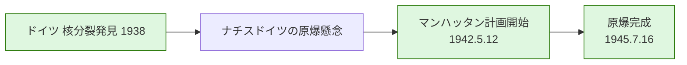
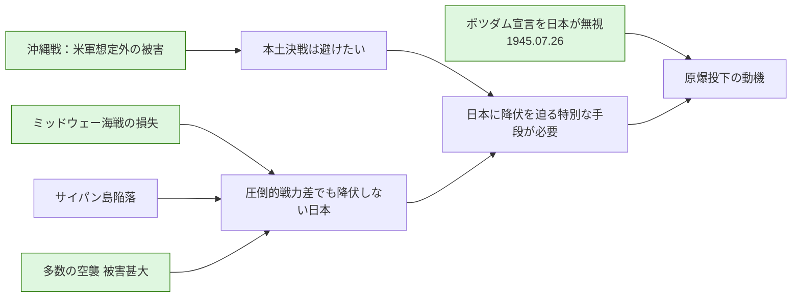
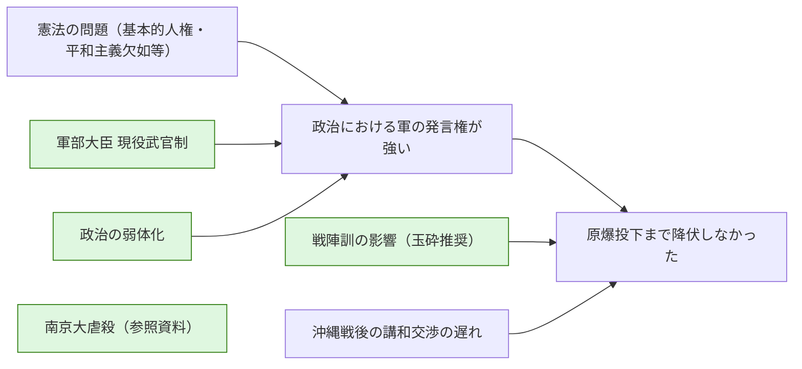
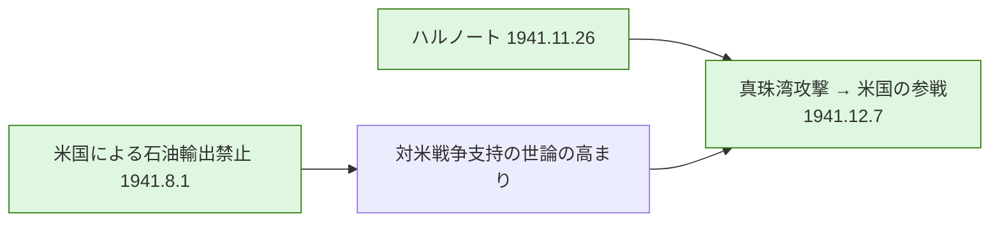

# waranalyze
戦争の分析

以下は `war.dot` の各要因カテゴリを個別に示した図です。図中のノードはクリックで元の参考ページ（主に Wikipedia）に遷移します。

## 技術的要因



## 動機的要因（米国）



## 動機的要因（日本）



## 機会的要因



---

必要なら各章のノードをさらに詳細化（全ノード・全URLを反映）します。
    click E20_31A "https://ja.wikipedia.org/wiki/%E6%B2%96%E7%B8%84%E6%88%A6" "沖縄戦"
    click E20_41 "https://ja.wikipedia.org/wiki/%E3%83%9F%E3%83%83%E3%83%89%E3%82%A6%E3%82%A7%E3%83%BC%E6%B5%B7%E6%88%A6" "ミッドウェー海戦"
    click E20_43 "https://ja.wikipedia.org/wiki/%E6%97%A5%E6%9C%AC%E6%9C%AC%E5%9C%9F%E7%A9%BA%E8%A5%B2" "日本本土空襲"
    click E30_12 "https://ja.wikipedia.org/wiki/%E8%BB%8D%E9%83%A8%E5%A4%A7%E8%87%A3%E7%8F%BE%E5%BD%B9%E6%AD%A6%E5%AE%98%E5%88%B6" "軍部大臣 現役武官制"
    click E30_13A "https://ja.wikipedia.org/wiki/%E4%BA%94%E3%83%BB%E4%B8%80%E4%BA%94%E4%BA%8B%E4%BB%B6" "5.15事件"
    click E30_13B "https://ja.wikipedia.org/wiki/%E4%BA%8C%E3%83%BB%E4%BA%8C%E5%85%AD%E4%BA%8B%E4%BB%B6" "2.26事件"
    click E30_20 "https://ja.wikipedia.org/wiki/%E6%88%A6%E9%99%A3%E8%A8%93#:~:text=%E6%88%A6%E9%99%A3%E3%81%A7%E3%81%AE%E8%A8%93%E6%88%92%E3%81%AE,%E8%A8%93%E4%B8%80%E5%8F%B7%EF%BC%89%E3%82%92%E6%8C%87%E3%81%99%E3%80%82" "戦陣訓"
    click E30_22 "https://seesaawiki.jp/w/nankingfaq/" "南京大虐殺（外部）"
    click E30_220 "https://ja.wikipedia.org/wiki/%E7%AC%AC%E4%BA%8C%E6%AC%A1%E4%B8%8A%E6%B5%B7%E4%BA%8B%E5%A4%89" "第二次上海事変"
    click E40_00 "https://ja.wikipedia.org/wiki/%E7%9C%9F%E7%8F%A0%E6%B9%BE%E6%94%BB%E6%92%83" "真珠湾攻撃／米国参戦"
    click E40_10 "https://ja.wikipedia.org/wiki/%E3%83%8F%E3%83%AB%E3%83%BB%E3%83%8E%E3%83%BC%E3%83%88" "ハルノート"
    click E40_200 "https://www.jacar.go.jp/nichibei/popup/pop_13.html" "米国による石油輸出禁止（資料）"
    click E40_2000 "https://ja.wikipedia.org/wiki/%E4%BB%8F%E5%8D%B0%E9%80%B2%E9%A7%90" "仏印進駐"
    click E40_20001 "https://ja.wikipedia.org/wiki/%E5%A4%A7%E6%9D%B1%E4%BA%9C%E5%85%B1%E6%A0%84%E5%9C%8F" "大東亜共栄圏"
    click E40_201A "https://ja.wikipedia.org/wiki/%E6%97%A5%E6%B8%85%E6%88%A6%E4%BA%89" "日清戦争"
    click E40_201B "https://ja.wikipedia.org/wiki/%E6%97%A5%E9%9C%B2%E6%88%A6%E4%BA%89" "日露戦争"
  ```

注: 元の `war.dot` に含まれる各ノードの詳細ラベルや外部URLは、Mermaid の簡潔さのため簡略化しています。必要ならすべてのノードと改行・URLを保持する完全変換も作成できます。


